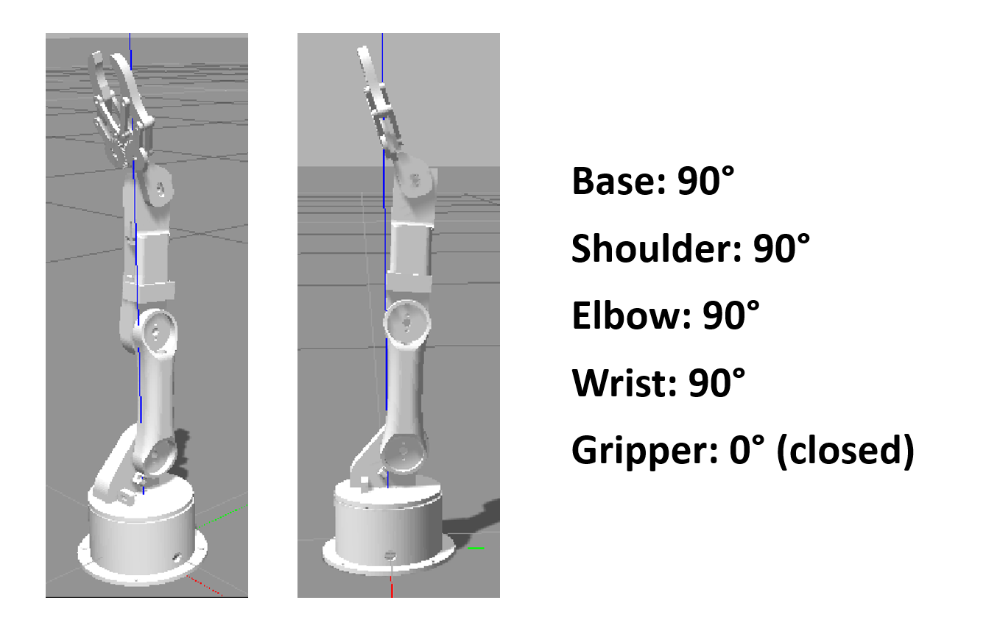

# arduino_robot_arm
ROS packages that can be used to plan and execute motion trajectories for a robot arm in simulation and real-life.


These packages were tested under ROS kinetic and Ubuntu 16.04 and it works perfectly on ROS melodic and noetic

The robot arm uses Moveit plugin to apply kinematics by the KDL solver. These packages can be tested in the gazebo simulation tool and the real robot arm, where the ROS system and Arduino code share the ```/joint_states``` topic to control motors.


## Dependencies
run this instruction inside your workspace:

```$ rosdep install --from-paths src --ignore-src -r -y```

make sure you installed all these packages:

for kinetic distro

```
$ sudo apt-get install ros-kinetic-moveit
$ sudo apt-get install ros-kinetic-joint-state-publisher ros-kinetic-joint-state-publisher-gui
$ sudo apt-get install ros-kinetic-gazebo-ros-control joint-state-publisher
$ sudo apt-get install ros-kinetic-ros-controllers ros-kinetic-ros-control
```

for melodic distro

```
$ sudo apt-get install ros-melodic-moveit
$ sudo apt-get install ros-melodic-joint-state-publisher ros-melodic-joint-state-publisher-gui
$ sudo apt-get install ros-melodic-gazebo-ros-control joint-state-publisher
$ sudo apt-get install ros-melodic-ros-controllers ros-melodic-ros-control
```

for noetic distro

```
$ sudo apt-get install ros-noetic-moveit
$ sudo apt-get install ros-noetic-joint-state-publisher ros-noetic-joint-state-publisher-gui
$ sudo apt-get install ros-noetic-gazebo-ros-control joint-state-publisher
$ sudo apt-get install ros-noetic-ros-controllers ros-noetic-ros-control
```

## Robot Arm
The robot arm has 5 joints only 4 joints can be fully controlled via ROS and Rviz, the last joint (gripper) has a default motion executed from the Arduino code directly.
### Circuit diagram 

### Robot initial positions


## Configuring Arduino with ROS
- Install Arduino IDE in Ubuntu
https://www.arduino.cc/en/software
to install run ```$ sudo ./install.sh``` after unzipping the folder

- Launch the Arduino IDE

- Install the arduino package and ros library
http://wiki.ros.org/rosserial_arduino/Tutorials/Arduino%20IDE%20Setup

- Make sure to change the port permission before uploading the Arduino code
```$ sudo chmod 777 /dev/ttyUSB0```

## Usage
### Controlling the robot arm by joint_state_publisher
```$ roslaunch robot_arm_pkg check_motors.launch```

You can also connect with hardware by running:

```$ rosrun rosserial_python serial_node.py _port:=/dev/ttyUSB0 _baud:=115200```

(Note: You may need to use ttyACM)

#### Simulation
Run the following instructions to use gazebo
```
$ roslaunch robot_arm_pkg check_motors.launch
$ roslaunch robot_arm_pkg check_motors_gazebo.launch
$ rosrun robot_arm_pkg joint_states_to_gazebo.py
```
(You may need to change the permission)

```$ sudo chmod +x ~/catkin_ws/src/arduino_robot_arm/robot_arm_pkg/scripts/joint_states_to_gazebo.py```


### Controlling the robot arm by Moveit and kinematics
```$ roslaunch moveit_pkg demo.launch```

You can also connect with hardware by running:

```$ rosrun rosserial_python serial_node.py _port:=/dev/ttyUSB0 _baud:=115200```

(Note: You may need to use ttyACM)

#### Simulation
Run the following instruction to use gazebo

```$ roslaunch moveit_pkg demo_gazebo.launch```

***

# Pick and place by using OpenCV
## Preparation 
Download webcam extension for VirtualBox

https://scribles.net/using-webcam-in-virtualbox-guest-os-on-windows-host/ 

## Testing the camera and OpenCV

Run color_thresholding.py to test the camera 

Before running, find the camera index normally it is video0

```$ ls -l /dev | grep video```

If it is not, update line 8 in color_thresholding.py

```8  cap=cv2.VideoCapture(0)```

Then run 

```$ python color_thresholding.py```

## Using OpenCV with the robot arm in ROS
###	In Real Robot
- In a terminal run

```$ roslaunch moveit_pkg demo.launch```

this will run Rviz 


- connect with Arduino:

1. select the Arduino port to be used on Ubuntu system

2. change the permissions (it might be ttyACM)

	```$ ls -l /dev | grep ttyUSB```
  
	```$ sudo chmod -R 777 /dev/ttyUSB0```
  
3. upload the code from Arduino IDE

```$ rosrun rosserial_python serial_node.py _port:=/dev/ttyACM0 _baud:=115200```

- In another terminal 

```$ rosrun moveit_pkg get_pose_openCV.py```

This will detect **blue** color and publish the x,y coordinates to /direction topic

(Note: check the camera index and update the script if needed)

- Open another terminal 

```$ rosrun moveit_pkg move_group_node```

This will subscribe to /direction topic and execute motion by using **Moveit move group**

The pick and place actions are performed from the Arduino sketch directly. 


### In simulation (Gazebo)
- In a terminal run

```$ roslaunch moveit_pkg demo_gazebo.launch```

this will run Rviz and gazebo

- In another terminal 

```$ rosrun moveit_pkg get_pose_openCV.py```

This will detect **blue** color and publish the x,y coordinates to /direction topic

(Note: check the camera index and update the script if needed)

- Open another terminal
 
```$ rosrun moveit_pkg move_group_node```

This will subscribe to /direction topic and execute motion by using Moveit move group

**We can’t visualize the pick and place actions in gazebo**
